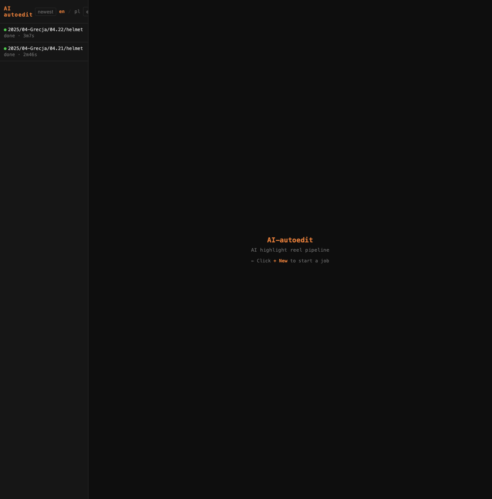
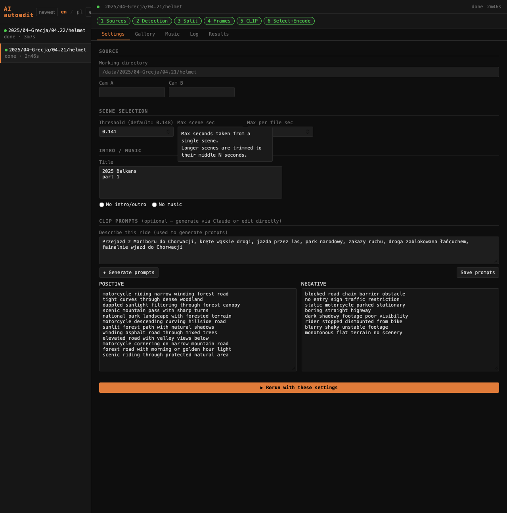
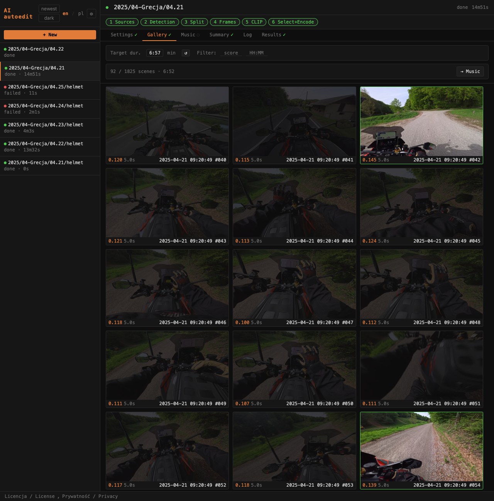
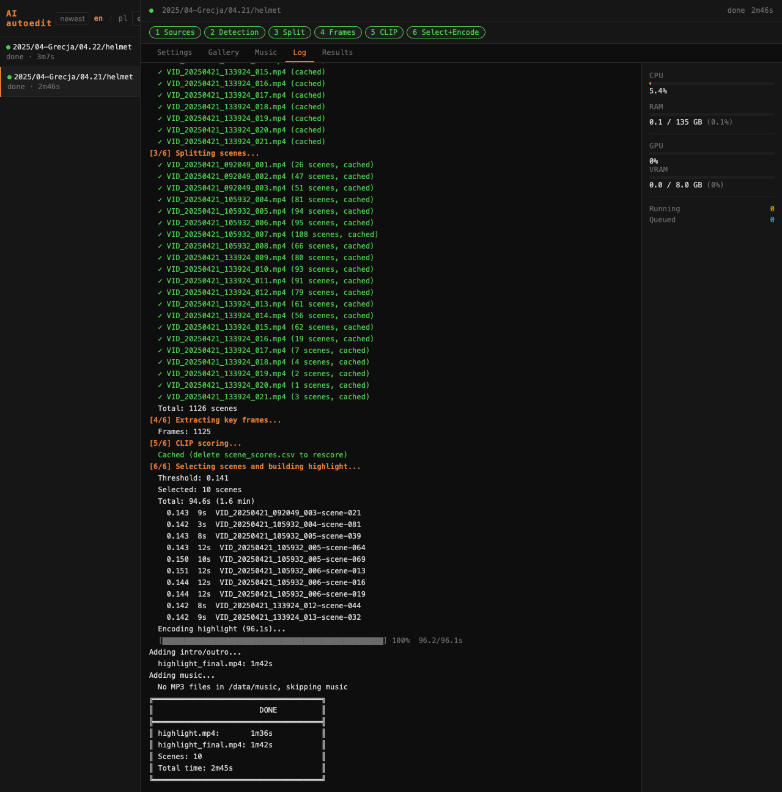

# AI-autoedit — AI Highlight Reel Pipeline

Każdy dzień na motocyklu to kilkaset gigabajtów surowego materiału z jednej lub dwóch kamer. Ręczny montaż zajmuje wielokrotnie więcej czasu niż sam wyjazd. AI-autoedit rozwiązuje ten problem — uruchamiasz pipeline przez przeglądarkę, highlight gotowy.

Model CLIP ocenia każdą scenę semantycznie (rozumie co jest w kadrze, nie tylko ruch czy jasność), wybiera najlepsze ujęcia i miesza z muzyką dobraną do charakteru nagrania. Możesz ręcznie oznaczyć sceny do włączenia lub wykluczenia w przeglądarce klatek — pipeline uwzględni je przy ponownym przetwarzaniu.

Every day on a motorcycle produces hundreds of gigabytes of raw footage. AI-autoedit processes it automatically: CLIP scores each scene semantically, selects the best shots, and mixes in music matched to the ride's character. You can manually override frame selection through the browser — the pipeline applies overrides on rerun.

## Przykładowy film / Sample output

[](https://www.youtube.com/watch?v=kR-plye7V2s)

---

## Web UI

AI-autoedit działa jako aplikacja webowa — pipeline uruchamiany przez przeglądarkę, logi w czasie rzeczywistym, podgląd wyników bez kopiowania plików.

AI-autoedit runs as a web app — pipeline launched from the browser, real-time logs, results preview without copying files.

### Lista projektów / Project list



Lewy pasek wyświetla historię zadań z ich statusem (done / running / failed) i czasem trwania. Przełącznik **en / pl** zmienia język interfejsu bez przeładowania strony.

The left sidebar shows job history with status and elapsed time. The **en / pl** switcher changes the interface language without page reload.

### Ustawienia projektu / Project settings



Zakładka **Settings** pozwala zmieniać próg CLIP, czas sceny, czas na plik, prompty CLIP i ustawienia muzyki bez wychodzenia z przeglądarki. **Rerun with these settings** zapisuje konfigurację do `config.ini` projektu i uruchamia pipeline ponownie.

The **Settings** tab lets you adjust the CLIP threshold, scene duration, per-file cap, CLIP prompts and music settings. **Rerun with these settings** saves the config to the project's `config.ini` and reruns the pipeline.

### Galeria scen / Scene gallery



Galeria pokazuje klatkę środkową każdej wykrytej sceny z jej wynikiem CLIP. Suwakiem **Threshold** filtrujesz które sceny byłyby wybrane przy bieżącym progu. Kliknięcie klatki dodaje ją do wymuszenia (force include) lub wyklucza ją (force exclude) — ta decyzja jest zapisywana po stronie serwera i stosowana przy **Rerun**.

The gallery shows the midpoint frame of each detected scene with its CLIP score. The **Threshold** slider filters which scenes would be selected. Clicking a frame toggles force-include or force-exclude — saved server-side and applied on **Rerun**.

### Biblioteka muzyczna / Music library


Zakładka **Music** pokazuje zaindeksowane utwory z folderu muzycznego (MP3/M4A) z wykonawcą, tytułem, BPM, energią i gatunkiem. Indeks ładuje się automatycznie przy otwieraniu projektu. Filtruj po nazwie lub gatunku, zaznacz konkretne ścieżki, przebuduj indeks po dodaniu nowych plików.

Przycisk **↺ Aktualizuj indeks** ma dwa ptaszki:
- **re-analiza** — wymusza ponowne liczenie BPM/energii dla wszystkich ścieżek (`--force`)
- **re-gatunki** — odświeża tylko gatunki bez ponownej analizy audio (`--force-genres`)

The **Music** tab shows indexed tracks (MP3/M4A) with artist, title, BPM, energy, and genre. The index loads automatically when a project is opened. Filter by name or genre, select specific tracks, rebuild the index after adding new files.

The **↺ Update index** button has two checkboxes:
- **re-analyze** — forces BPM/energy re-analysis for all tracks (`--force`)
- **re-genres** — re-fetches genres only, without re-analyzing audio (`--force-genres`)

Gatunek wyciągany jest w kolejności priorytetów / Genre is resolved in priority order:

1. Tagi osadzone w pliku (ID3/iTunes) — `ffprobe` / Embedded file tags via `ffprobe`
2. Wzorzec nazwy pliku `｜ Genre ｜` (konwencja NCS) / Filename pattern (NCS convention)
3. Last.fm API — tylko jeśli ustawiony `LAST_FM_API_KEY` / Last.fm API — only if `LAST_FM_API_KEY` is set

### Log i statystyki systemu / Log and system stats



Zakładka **Log** pokazuje pełny output pipeline w czasie rzeczywistym. Pasek postępu podczas enkodowania aktualizuje się na bieżąco. Po prawej wykresy CPU, RAM, GPU i VRAM oraz kolejka zadań.

The **Log** tab shows full pipeline output in real time. The encoding progress bar updates continuously. On the right: CPU, RAM, GPU and VRAM bars plus the job queue.

### Wyniki i odtwarzacz / Results and player


Zakładka **Results** wyświetla gotowe pliki wideo. Kliknięcie otwiera wbudowany odtwarzacz. Kolejne rundy z nową muzyką tworzą pliki `highlight_final_music_v1.mp4`, `v2.mp4` itd. — poprzednie wersje nie są nadpisywane.

The **Results** tab lists finished video files. Clicking opens the built-in player. Each music rerun creates `highlight_final_music_v1.mp4`, `v2.mp4` etc. — previous versions are preserved.

### Upload na YouTube / YouTube upload

Przycisk **▲ YT** przy każdym pliku otwiera modal uploadu: tytuł (pre-filled z nazwy projektu), opis, prywatność (private / unlisted / public), wybór playlisty lub utworzenie nowej. Progres uploadu widoczny w czasie rzeczywistym.

The **▲ YT** button next to each result file opens the upload modal: title (pre-filled from project name), description, privacy setting, playlist selection or new playlist creation. Upload progress is shown in real time.

**Konfiguracja / Setup:**

1. Utwórz projekt w [Google Cloud Console](https://console.cloud.google.com) → włącz **YouTube Data API v3**
2. **APIs & Services → Credentials → + Create Credentials → OAuth client ID** → typ **Web application**
3. Dodaj authorized redirect URI: `https://<twój-host>/api/youtube/callback`
4. Pobierz JSON i zapisz jako `webapp/youtube_client_secrets.json`
5. W OAuth consent screen dodaj swoje konto do **Test users**
6. W UI: **⚙ Settings → YouTube → Connect**

Token jest zapisywany w `webapp/youtube_token.json` i odświeżany automatycznie.

---

## Pipeline — jak działa / How it works

| Krok / Step | Opis / Description |
|-------------|-------------------|
| 1 | Znalezienie plików MP4 w katalogu / Find MP4 files in working directory |
| 2 | Detekcja cięć — PySceneDetect `detect-content` / Scene cut detection |
| 3 | Podział — każda scena jako osobny plik w `_autoframe/autocut/` / Scene split via stream copy |
| 4 | Ekstrakcja klatki środkowej dla każdego klipu / Key frame extraction (midpoint JPEG) |
| 5 | Scoring CLIP — `ViT-L-14` na GPU, `final = pos_score − neg_score × neg_weight` / CLIP scoring on GPU |
| 6 | Selekcja + manualne overrides + przycinanie + enkodowanie highlight / Selection + overrides + trim + encode |
| 7 | Intro (klatka z najwyższym score) + outro + fade / Intro (top-scoring frame) + outro + fade |
| 8 | Dobór muzyki z biblioteki, miks, wersjonowanie / Music selection, mix, version output |

Wyniki kroków 1–5 są cache'owane — ponowne uruchomienie (np. po zmianie threshold) pomija już przetworzone etapy.

Steps 1–5 are cached — rerun after changing threshold or overrides skips already-processed stages.

### Pliki wyjściowe / Output files

```
projekt/
├── highlight_final_music_v1.mp4   ← główny wynik / main output
├── highlight_final_music_v2.mp4   ← kolejna muzyka / next music run
└── _autoframe/
    ├── highlight.mp4              ← surowy highlight bez intro / raw highlight
    ├── highlight_final.mp4        ← z intro/outro, bez muzyki / with intro/outro
    ├── autocut/                   ← pocięte sceny / split scenes
    ├── frames/                    ← klatki do scoringu / scoring frames
    ├── scene_scores.csv           ← wyniki CLIP / CLIP scores
    ├── selected_scenes.txt        ← lista do ffmpeg concat / concat list
    └── manual_overrides.json      ← ręczne oznaczenia z galerii / gallery overrides
```

---

## Instalacja przez Docker / Docker installation

Zalecana metoda. Środowisko z PyTorch, CLIP, ffmpeg z NVENC gotowe do uruchomienia.

Recommended method. PyTorch, CLIP, and ffmpeg with NVENC are pre-installed.

### Wymagania / Requirements

- Docker z NVIDIA Container Toolkit
- GPU NVIDIA z CUDA (testowane: RTX 3070 Ti, driver 550)
- ~5 GB VRAM (model ViT-L-14)

### Uruchomienie / Start

```bash
git clone https://github.com/pawko/ai-autoedit ~/ai-autoedit
cd ~/ai-autoedit

# Skopiuj .env.example i ustaw ścieżki / Copy .env.example and set paths
cp .env.example .env
# edytuj .env: DATA_DIR=/home/user/moto, ANTHROPIC_API_KEY=sk-...

docker compose up -d
```

Webapp dostępna pod / Available at: **http://0.0.0.0:8000**

### .env

```env
DATA_DIR=/home/user/moto       # katalog z materiałem / footage root
ANTHROPIC_API_KEY=sk-ant-...   # opcjonalne, do generowania promptów CLIP / optional, for CLIP prompt generation
LAST_FM_API_KEY=...            # opcjonalne, do enrichmentu gatunków muzycznych / optional, for music genre enrichment
```

### Aktualizacja / Live updates

Zarówno `webapp/` jak i `src/` są montowane na żywo — zmiany w HTML/JS/Python działają bez rebuildu obrazu. `docker compose up -d` nie nadpisuje zamontowanych katalogów.

Both `webapp/` and `src/` are live-mounted — changes to HTML/JS/Python take effect without rebuilding the image. `docker compose up -d` never overwrites mounted directories.

---

## Konfiguracja / Configuration

Konfiguracja dwupoziomowa: globalny `config.ini` w repozytorium + opcjonalny `config.ini` w katalogu projektu (ma pierwszeństwo).

Two-level configuration: global `config.ini` in the repo + optional per-project `config.ini` (takes precedence).

Przez web UI: zakładka **Settings** → **Rerun** zapisuje zmiany do `config.ini` projektu automatycznie.

Via web UI: **Settings** tab → **Rerun** saves changes to the project's `config.ini` automatically.

### Kluczowe parametry / Key parameters

| Parametr | Domyślnie | Opis / Description |
|----------|-----------|-------------------|
| `scene_selection.threshold` | `0.148` | Minimalny score CLIP. Typowy zakres 0.13–0.16 / Minimum CLIP score |
| `scene_selection.max_scene_sec` | `10` | Max sekund z jednej sceny / Max seconds per scene |
| `scene_selection.max_per_file_sec` | `45` | Max łącznych sekund z pliku / Max seconds per source file |
| `scene_detection.threshold` | `20` | Czułość detekcji cięć / Scene cut sensitivity |
| `video.resolution` | `3840:2160` | Rozdzielczość wyjściowa / Output resolution |
| `video.framerate` | `60` | Klatkaż / Framerate |
| `music.music_volume` | `0.7` | Głośność muzyki / Music volume (0–1) |
| `music.original_volume` | `0.3` | Głośność oryginału / Original audio volume |

Pełna dokumentacja: [docs/configuration.md](docs/configuration.md)

### Prompty CLIP / CLIP prompts

```ini
[clip_prompts]
positive =
    scenic motorcycle road trip through mountains
    winding mountain pass with beautiful surroundings

negative =
    boring flat highway with no scenery
    parking lot or gas station
```

Prompty generowane automatycznie przez Claude — opisz dzień jazdy w polu **Settings → Describe this ride**, kliknij **Generate prompts**.

Prompts can be auto-generated by Claude — describe the ride in **Settings → Describe this ride**, click **Generate prompts**.

---

## Dokumentacja / Documentation

- [Jak to działa / How it works](docs/how-it-works.md)
- [Instalacja / Installation](docs/installation.md)
- [Konfiguracja / Configuration reference](docs/configuration.md)
- [Biblioteka muzyczna / Music library](docs/music.md)
