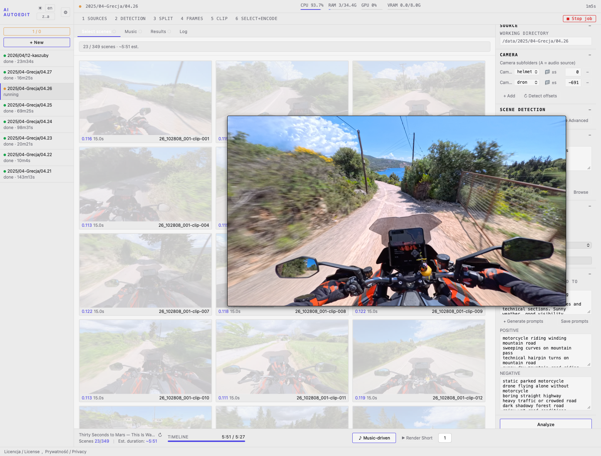

# Zakładka Select scenes / Select scenes tab

Zakładka **Select scenes** pokazuje klatkę środkową każdej wykrytej sceny z jej wynikiem CLIP, posortowane chronologicznie.

The **Select scenes** tab shows the midpoint frame of each detected scene with its CLIP score, sorted chronologically.

---

## Target dur.

Pole **Target dur.** (format `m:ss`, np. `6:45`) ustawia docelowy czas highlight. Po wpisaniu i naciśnięciu Enter uruchamia się automatyczne szukanie progu CLIP — wyszukiwanie binarne po stronie klienta (20 iteracji, konwergencja `hi−lo < 0.0001`), natychmiastowe. Wynik — liczba scen i szacowany czas — pojawia się w liczniku nad Select scenes.

The **Target dur.** field (format `m:ss`, e.g. `6:45`) sets the target highlight duration. On Enter, an automatic CLIP threshold binary search runs client-side (20 iterations, `hi−lo < 0.0001` convergence), instant — no server round-trip. The result — scene count and estimated duration — appears in the counter above the gallery.

Jeśli zadany czas jest nieosiągalny (za mało materiału), wyświetlane jest ostrzeżenie `⚠ max ~m:ss`.

If the target is unreachable (not enough footage), a `⚠ max ~m:ss` warning is shown.

---

### Szacowany czas / Duration estimate

Licznik nad Select scenes (`N / total scenes · m:ss`) pokazuje:

- **Po renderze** — dokładny wynik ostatniego rendera.
- **Po zmianie overrides** — estymację z DRY_RUN (dokładny Python, nie aproksymacja JS), aktualizowaną ~1 s po zmianie.
- **Dual-camera** — wynik uwzględnia sparowane sceny z drugiej kamery.

The counter above the gallery (`N / total scenes · m:ss`) shows:

- **After render** — exact result of the last render.
- **After override change** — DRY_RUN estimate (exact Python), updated ~1 s after the change.
- **Dual-camera** — result accounts for paired back-cam scenes.

### Odznaka czasu sceny / Scene duration badge

Pod wynikiem CLIP każdej sceny wyświetlany jest efektywny czas jej udziału w filmie (po zastosowaniu Max scene sec).

Below each scene's CLIP score, the effective clip duration (after applying Max scene sec cap) is shown.

### Data i godzina sceny / Scene timestamp

Pod każdą klatką wyświetlany jest rzeczywisty czas nagrania sceny: `creation_time` z metadanych MP4 pliku źródłowego + offset sceny z pliku CSV PySceneDetect. Czas podawany jest w strefie czasowej przeglądarki.

Filename-based timestamp matching is unreliable for multi-chapter sessions (GoPro/Insta360 reuse the session start time for all chapter files). The gallery reads `creation_time` from MP4 metadata via ffprobe and adds the scene's start offset from the PySceneDetect CSV.

Below each frame the actual recording time is shown: `YYYY-MM-DD HH:MM:SS #N` (browser local time).

---

## Limit per file

Sceny które przeszły threshold, ale zostały odcięte przez `max_per_file_sec`, oznaczone są bursztynową ramką z plakietką **limit**. Kliknięcie takiej sceny force-include'uje ją (z pominięciem limitu).

Scenes that passed the threshold but were cut by `max_per_file_sec` are shown with an amber border and **limit** badge. Clicking such a scene force-includes it (bypassing the cap).

---

## Manualne overrides / Manual overrides

Kliknięcie klatki przełącza jej status w trójstanowym cyklu:
- **auto → include** (niebieska przerywana ramka) — scena zawsze trafia do renderu, niezależnie od progu
- **include → ban** (czerwona pełna ramka, przyciemniony obraz) — scena *nigdy* nie trafi do renderu, nawet jako fallback
- **ban → auto** (powrót do decyzji algorytmu)

**Sceny nieoznaczone (auto) poniżej progu nie trafiają do renderu.** Music-driven render uzupełnia pulę scenami poniżej progu tylko gdy wybranych jest za mało — ale sceny z `ban` są wykluczone nawet wtedy.

W trybie multi-cam (helmet + back): zbanowanie sceny z kamery głównej automatycznie banuje sceny z kamery back w tym samym oknie czasowym (`sync-ban`).

Overrides zapisywane są po stronie serwera w `_autoframe/manual_overrides.json` i stosowane przy każdym kolejnym renderze.

---

Clicking a frame cycles through three states:
- **auto → include** (blue dashed border) — scene always included in render regardless of threshold
- **include → ban** (red solid border, dimmed image) — scene *never* included in render, not even as fallback
- **ban → auto** (back to algorithm decision)

**Unmarked (auto) scenes below threshold never appear in the render.** Music-driven render fills the pool with below-threshold scenes only when selected scenes are insufficient — but `ban` scenes are excluded even then.

In multi-cam mode (helmet + back): banning a main-cam scene automatically bans back-cam scenes overlapping the same time window (`sync-ban`).

Overrides are saved server-side in `_autoframe/manual_overrides.json` and applied on every render.

---

## Filter / Min gap

### Min gap

Pole **Min gap** (sekundy, brak strzałek) ustawia minimalny odstęp między automatycznie wybranymi scenami na osi czasu. Sceny zbyt blisko poprzedniej zaznaczonej są wykluczone (bursztynowa ramka z plakietką **limit**). Manualne overrides (force-include) ignorują gap filter.

The **Min gap** field (seconds, no spinners) sets the minimum gap between auto-selected scenes on the timeline. Scenes too close to the previous selected scene are excluded (amber border with **limit** badge). Manual force-includes bypass the gap filter.

Zmiana wartości natychmiast przelicza galerię bez reload.

Changing the value immediately recalculates the gallery without reload.

---

## Beats per shot (Music-driven)

Widżet **▼ N·N·N ▲** (np. `3·4·6`) steruje liczbą beatów na ujęcie dla każdego z trzech tierów tempa w music-driven render:

- **fast** (szybkie fragmenty — chorus, peak energy) — domyślnie 3 beaty/ujęcie
- **mid** (środkowe fragmenty) — domyślnie 4 beaty/ujęcie
- **slow** (wolne fragmenty — intro, outro) — domyślnie 6 beatów/ujęcie

Przyciski **▼ / ▲** zmieniają wszystkie trzy wartości razem (−1 / +1), zachowując proporcje. Zmiana natychmiast aktualizuje szacowane długości ujęć (przy aktualnym BPM wybranego utworu). Wartości zapisywane do `[music_driven]` w `config.ini` projektu.

The **▼ N·N·N ▲** widget (e.g. `3·4·6`) controls beats-per-shot for the three tempo tiers in music-driven render:

- **fast** (chorus / peak energy segments) — default 3 beats/shot
- **mid** (middle segments) — default 4 beats/shot
- **slow** (intro/outro segments) — default 6 beats/shot

**▼ / ▲** shift all three values together (−1/+1), preserving relative spacing. Changing the value immediately updates the per-tier duration preview (at the current track's BPM). Saved to `[music_driven]` in the project `config.ini`.

---

## ↺ Reset

Czyści wszystkie manualne overrides i ponownie uruchamia automatyczne wyszukiwanie progu dla bieżącego Target dur. (lub przywraca próg z analizy, jeśli Target dur. nie jest ustawione).

Clears all manual overrides and re-runs the automatic threshold search for the current Target dur. (or restores the analysis threshold if Target dur. is not set).

---

## → Music

Przycisk w prawym górnym rogu zakładki przenosi bezpośrednio na zakładkę Music.

Button in the top-right of the tab switches directly to the Music tab.
