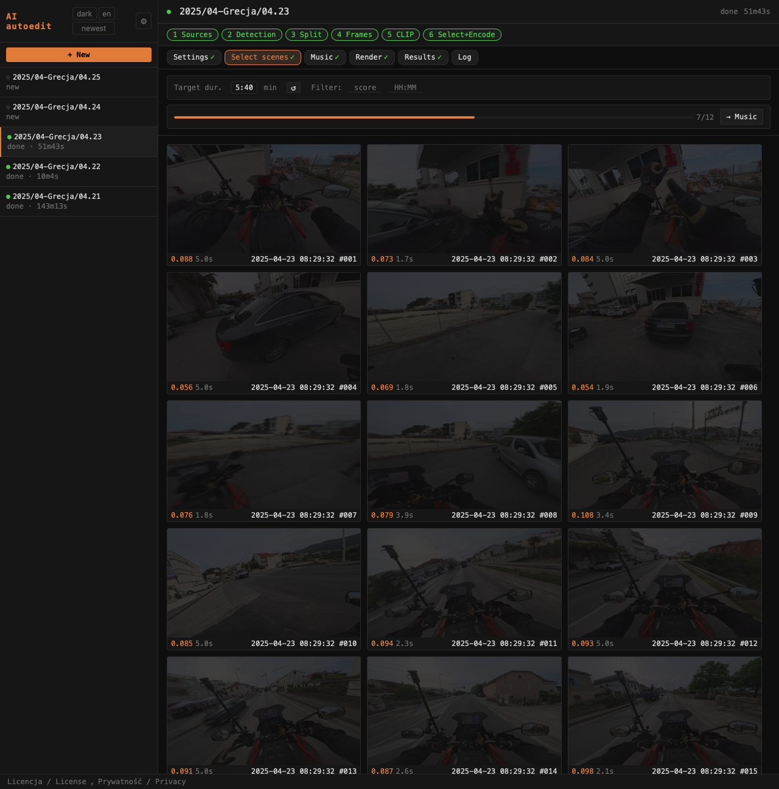

# Zakładka Select scenes / Select scenes tab

Zakładka **Select scenes** pokazuje klatkę środkową każdej wykrytej sceny z jej wynikiem CLIP, posortowane chronologicznie.

The **Select scenes** tab shows the midpoint frame of each detected scene with its CLIP score, sorted chronologically.

---

## Target dur.

Pole **Target dur.** (format `m:ss`, np. `6:45`) ustawia docelowy czas highlight. Po wpisaniu i naciśnięciu Enter (lub zmianie wartości) uruchamia się automatyczne szukanie progu CLIP binarnym wyszukiwaniem (12 iteracji na backendzie z DRY_RUN), tak żeby uzyskać film jak najbliższy zadanemu czasowi. Wynik — liczba scen i szacowany czas — pojawia się w liczniku nad Select scenes.

The **Target dur.** field (format `m:ss`, e.g. `6:45`) sets the target highlight duration. On Enter or value change, an automatic binary threshold search (12 iterations, backend DRY_RUN) finds the CLIP threshold that produces a film closest to the target. The result — scene count and estimated duration — appears in the counter above the gallery.

Jeśli zadany czas jest nieosiągalny (za mało materiału), wyświetlane jest ostrzeżenie `⚠ max ~m:ss`.

If the target is unreachable (not enough footage), a `⚠ max ~m:ss` warning is shown.

---

### Szacowany czas / Duration estimate

Licznik nad Select scenes (`N / total scenes · m:ss`) pokazuje:

- **Po renderze** — dokładny wynik ostatniego rendera.
- **Po zmianie overrides** — estymację z DRY_RUN (dokładny Python, nie aproksymacja JS), aktualizowaną ~1 s po zmianie.
- **Dual-camera** — wynik uwzględnia sparowane sceny z drugiej kamery.

The counter above the gallery (`N / total scenes · m:ss`) shows:

- **After render** — exact result of the last render.
- **After override change** — DRY_RUN estimate (exact Python), updated ~1 s after the change.
- **Dual-camera** — result accounts for paired back-cam scenes.

### Odznaka czasu sceny / Scene duration badge

Pod wynikiem CLIP każdej sceny wyświetlany jest efektywny czas jej udziału w filmie (po zastosowaniu Max scene sec).

Below each scene's CLIP score, the effective clip duration (after applying Max scene sec cap) is shown.

### Data i godzina sceny / Scene timestamp

Pod każdą klatką wyświetlany jest rzeczywisty czas nagrania sceny: `creation_time` z metadanych MP4 pliku źródłowego + offset sceny z pliku CSV PySceneDetect. Czas podawany jest w strefie czasowej przeglądarki.

Filename-based timestamp matching is unreliable for multi-chapter sessions (GoPro/Insta360 reuse the session start time for all chapter files). The gallery reads `creation_time` from MP4 metadata via ffprobe and adds the scene's start offset from the PySceneDetect CSV.

Below each frame the actual recording time is shown: `YYYY-MM-DD HH:MM:SS #N` (browser local time).

---

## Limit per file

Sceny które przeszły threshold, ale zostały odcięte przez `max_per_file_sec`, oznaczone są bursztynową ramką z plakietką **limit**. Kliknięcie takiej sceny force-include'uje ją (z pominięciem limitu).

Scenes that passed the threshold but were cut by `max_per_file_sec` are shown with an amber border and **limit** badge. Clicking such a scene force-includes it (bypassing the cap).

---

## Manualne overrides / Manual overrides

Kliknięcie klatki przełącza jej status:
- **Included → force-exclude** (ciemna ramka, ikona ×)
- **Excluded → force-include** (zielona ramka, ikona ✓)
- **Manual → reset** (powrót do decyzji threshold)

Overrides zapisywane są po stronie serwera w `_autoframe/manual_overrides.json` i stosowane przy każdym kolejnym renderze. Zmiana Target dur. przelicza threshold z uwzględnieniem aktywnych overrides.

Clicking a frame toggles its status:
- **Included → force-exclude** (dark border, × icon)
- **Excluded → force-include** (green border, ✓ icon)
- **Manual → reset** (back to threshold decision)

Overrides are saved server-side in `_autoframe/manual_overrides.json` and applied on every render. Changing Target dur. re-runs the search with active overrides respected.

---

## Filter / Min gap

### Min gap

Pole **Min gap** (sekundy, brak strzałek) ustawia minimalny odstęp między automatycznie wybranymi scenami na osi czasu. Sceny zbyt blisko poprzedniej zaznaczonej są wykluczone (bursztynowa ramka z plakietką **limit**). Manualne overrides (force-include) ignorują gap filter.

The **Min gap** field (seconds, no spinners) sets the minimum gap between auto-selected scenes on the timeline. Scenes too close to the previous selected scene are excluded (amber border with **limit** badge). Manual force-includes bypass the gap filter.

Zmiana wartości natychmiast przelicza galerię bez reload.

Changing the value immediately recalculates the gallery without reload.

---

## ↺ Reset

Czyści wszystkie manualne overrides i ponownie uruchamia automatyczne wyszukiwanie progu dla bieżącego Target dur. (lub przywraca próg z analizy, jeśli Target dur. nie jest ustawione).

Clears all manual overrides and re-runs the automatic threshold search for the current Target dur. (or restores the analysis threshold if Target dur. is not set).

---

## → Music

Przycisk w prawym górnym rogu zakładki przenosi bezpośrednio na zakładkę Music.

Button in the top-right of the tab switches directly to the Music tab.
