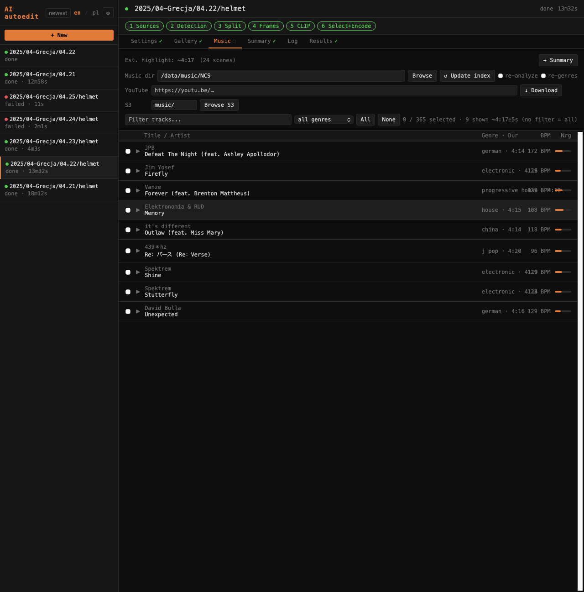

# Zakładka Music / Music tab

Zakładka **Music** pokazuje zaindeksowane ścieżki z katalogu muzycznego (MP3/M4A) z wykonawcą, tytułem, gatunkiem, BPM i energią.

The **Music** tab shows indexed tracks from the music directory (MP3/M4A) with artist, title, genre, BPM, and energy.

U góry zakładki widoczny jest szacowany czas highlight i liczba wybranych scen — np. `Est. highlight: 6:00 [45 scenes]`. Przycisk **→ Summary** przenosi do zakładki Summary.

At the top of the tab: estimated highlight duration and selected scene count — e.g. `Est. highlight: 6:00 [45 scenes]`. The **→ Summary** button navigates to the Summary tab.

---

## Katalog muzyczny / Music directory

Pole **Music dir** ustawia ścieżkę do biblioteki muzycznej. Ładuje ścieżki automatycznie po opuszczeniu pola. Przyciski:

The **Music dir** field sets the path to the music library. Loads tracks automatically on blur. Buttons:

| Przycisk | Opis |
|----------|------|
| **Browse** | Otwiera przeglądarkę katalogów do wyboru ścieżki |
| **↺ Update index** | Przebudowuje indeks BPM/energii/gatunków (patrz niżej) |

| Button | Description |
|--------|-------------|
| **Browse** | Opens a directory browser to pick the path |
| **↺ Update index** | Rebuilds the BPM/energy/genre index (see below) |

---

## Pobieranie z YouTube / YouTube download

Pole **YouTube** + przycisk **↓ Download** pobiera audio z podanego URL przez yt-dlp i konwertuje do MP3.

The **YouTube** field + **↓ Download** button fetches audio from the given URL via yt-dlp and converts to MP3.

Po pobraniu plik jest zapisywany automatycznie:

After download the file is saved automatically:

- **Gdy ustawiony jest Music dir** — plik trafia do katalogu muzycznego i pojawia się na liście po odświeżeniu indeksu
- **Gdy skonfigurowane jest S3** — plik jest wysyłany na S3 pod prefix z pola S3 (domyślnie `music/`), a jeśli ustawiony jest też Music dir — kopiowany lokalnie
- **Gdy nie ma Music dir ani S3** — plik pozostaje w katalogu tymczasowym i jest przypięty tylko na czas bieżącej sesji

- **When Music dir is set** — file goes to the music directory and appears in the list after index rebuild
- **When S3 is configured** — file is uploaded to S3 under the S3 prefix (default `music/`), and if Music dir is also set — copied locally as well
- **When neither Music dir nor S3 is set** — file stays in a temp directory and is pinned for the current session only

---

## Filtrowanie / Filtering

- Pole tekstowe **Filter** — filtruje po tytule lub wykonawcy
- Dropdown **genre** — filtruje po gatunku

Pokazywane są tylko ścieżki o czasie trwania zbliżonym do szacowanego czasu highlight (±5s). Jeśli lista jest pusta — rozszerz bibliotekę lub zmień threshold w Gallery.

Only tracks within ±5s of the estimated highlight duration are shown. If the list is empty — expand the library or adjust the Gallery threshold.

---

## Podgląd / Preview

Kliknięcie ▶ przy ścieżce uruchamia odtwarzanie. Pod tytułem pojawia się suwak seek do przewijania utworu. Kliknięcie ▶ ponownie lub przy innej ścieżce zatrzymuje poprzedni utwór.

Clicking ▶ next to a track starts playback. A seek bar appears below the title for scrubbing. Clicking ▶ again or on another track stops the previous one.

---

## Zaznaczanie / Selection

Checkboxy przy ścieżkach zaznaczają je do użycia w pipeline. Zaznaczenie przenosi się na kolejne rendery. Przyciski **All** / **None** zaznaczają lub odznaczają wszystkie widoczne (po filtrach) ścieżki.

Checkboxes next to tracks mark them for use in the pipeline. Selection persists across renders. **All** / **None** buttons select or deselect all currently visible (filtered) tracks.

---

## ↺ Update index

Przebudowuje indeks BPM/energii/gatunków. Rzeczywisty pasek postępu pokazuje analizę pliku po pliku. Po zakończeniu lista ścieżek odświeża się automatycznie.

Rebuilds the BPM/energy/genre index. A real per-file progress bar tracks the analysis. The track list refreshes automatically when done.

| Checkbox | Działanie |
|----------|-----------|
| **re-analyze** | Wymusza ponowne liczenie BPM i energii dla wszystkich plików |
| **re-genres** | Odświeża tylko gatunki przez Last.fm, bez ponownej analizy audio |

Szczegóły biblioteki muzycznej, budowania indeksu i logiki doboru: [Biblioteka muzyczna](music.md).

Details on the music library, index building, and selection logic: [Music library](music.md).

---

## Experimental / Untested

### S3 music

Gdy S3 jest skonfigurowane, w zakładce Music pojawia się wiersz **S3** z polem prefiksu i przyciskiem **Browse S3**.

When S3 is configured, a **S3** row appears in the Music tab with a prefix field and **Browse S3** button.

| Pole / Przycisk | Opis |
|-----------------|------|
| Pole prefiksu | Ścieżka w buckecie gdzie leży muzyka (domyślnie `music/`) |
| **Browse S3** | Pobiera listę plików MP3 z bucketu pod podanym prefiksem |
| **↓** przy pliku | Pobiera wybrany plik S3 do katalogu Music dir |
| **✕ Close** | Zamyka listę S3 |

Po pobraniu plik pojawia się w lokalnej bibliotece muzycznej i jest od razu dostępny do zaznaczenia.

After downloading, the file appears in the local music library and is immediately available for selection.
