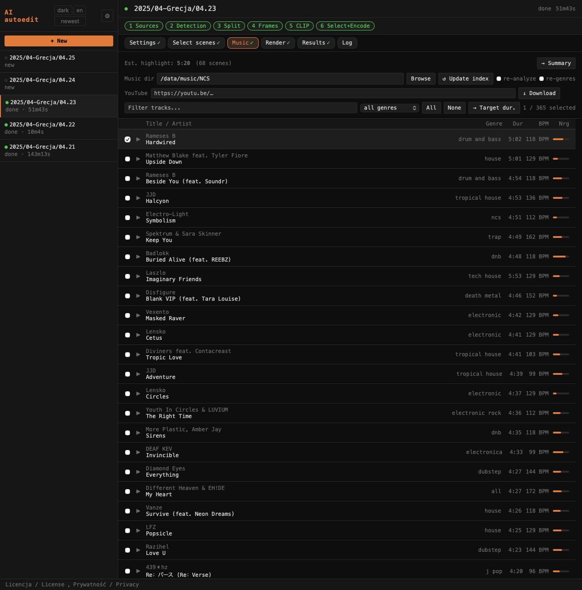

# Zakładka Music / Music tab



Zakładka **Music** pokazuje zaindeksowane ścieżki z katalogu muzycznego (MP3/M4A) z wykonawcą, tytułem, gatunkiem, BPM i energią.

The **Music** tab shows indexed tracks from the music directory (MP3/M4A) with artist, title, genre, BPM, and energy.

U góry zakładki widoczny jest szacowany czas highlight i liczba wybranych scen. Przycisk **→ Summary** przenosi do zakładki Summary.

At the top of the tab: estimated highlight duration and selected scene count. The **→ Summary** button navigates to the Summary tab.

---

## Katalog muzyczny / Music directory

Pole **Music dir** ustawia ścieżkę do biblioteki muzycznej. Ładuje ścieżki automatycznie po opuszczeniu pola. Przyciski:

The **Music dir** field sets the path to the music library. Loads tracks automatically on blur. Buttons:

| Przycisk | Opis |
|----------|------|
| **Browse** | Otwiera przeglądarkę katalogów do wyboru ścieżki |
| **↺ Update index** | Przebudowuje indeks BPM/energii/gatunków (patrz niżej) |

| Button | Description |
|--------|-------------|
| **Browse** | Opens a directory browser to pick the path |
| **↺ Update index** | Rebuilds the BPM/energy/genre index (see below) |

---

## Pobieranie z YouTube / YouTube download

Pole **YouTube** + przycisk **↓ Download** pobiera audio z podanego URL przez yt-dlp i konwertuje do MP3.

The **YouTube** field + **↓ Download** button fetches audio from the given URL via yt-dlp and converts to MP3.

Po pobraniu plik jest zapisywany automatycznie:

After download the file is saved automatically:

- **Gdy ustawiony jest Music dir** — plik trafia do katalogu muzycznego i pojawia się na liście po odświeżeniu indeksu
- **Gdy skonfigurowane jest S3** — plik jest wysyłany na S3 pod prefix z pola S3 (domyślnie `music/`), a jeśli ustawiony jest też Music dir — kopiowany lokalnie
- **Gdy nie ma Music dir ani S3** — plik pozostaje w katalogu tymczasowym i jest przypięty tylko na czas bieżącej sesji

- **When Music dir is set** — file goes to the music directory and appears in the list after index rebuild
- **When S3 is configured** — file is uploaded to S3 under the S3 prefix (default `music/`), and if Music dir is also set — copied locally as well
- **When neither Music dir nor S3 is set** — file stays in a temp directory and is pinned for the current session only

---

## Filtrowanie / Filtering

- Pole tekstowe **Filter** — filtruje jednocześnie po tytule i wykonawcy (szukanie podciągu, bez rozróżniania wielkości liter)
- Dropdown **genre** — filtruje po gatunku

- **Filter** text field — searches across both title and artist simultaneously (substring, case-insensitive)
- **genre** dropdown — filters by genre

---

## Sortowanie / Sort order

Domyślnie lista ścieżek sortowana jest według zbliżenia do aktualnego Target dur.: na górze utwór najbardziej pasujący długością, niżej na przemian dłuższe i krótsze (±1 s, ±2 s, ±3 s…). Gdy nie ma ustawionego Target dur., lista pojawia się w kolejności indeksu.

Przy każdym wejściu na zakładkę Music sortowanie jest resetowane do trybu domyślnego (est. dur.) i `calculateGalleryStats()` jest wywoływane — lista zawsze odzwierciedla aktualną szacowaną długość po zmianie zaznaczenia klatek w Select scenes.

Kliknięcie nagłówka kolumny (tytuł, czas, BPM, energia) przełącza na sortowanie wg tej kolumny. Ponowne kliknięcie odwraca kierunek. Kliknięcie raz jeszcze wraca do sortowania domyślnego.

By default tracks are sorted by proximity to the current Target dur.: the best-matching track is at the top, then alternating longer and shorter (±1 s, ±2 s, ±3 s…). If Target dur. is not set, tracks appear in index order.

On every entry to the Music tab, sort is reset to default (est. dur.) and `calculateGalleryStats()` is called — the list always reflects the current estimated duration after changing scene selection in Select scenes.

Clicking a column header (title, duration, BPM, energy) sorts by that column. Click again to reverse. Click once more to return to default sort.

---

## Podgląd / Preview

Kliknięcie ▶ przy ścieżce uruchamia odtwarzanie. Pod tytułem pojawia się suwak seek do przewijania utworu. Kliknięcie ▶ ponownie lub przy innej ścieżce zatrzymuje poprzedni utwór.

Clicking ▶ next to a track starts playback. A seek bar appears below the title for scrubbing. Clicking ▶ again or on another track stops the previous one.

---

## Usuwanie / Delete

Czerwony przycisk **✕** (widoczny po najechaniu kursorem na wiersz) usuwa utwór z dysku po potwierdzeniu. Plik MP3/M4A, wpis w `index.json` i ewentualny wpis w `shorts_used.json` są usuwane jednocześnie.

The red **✕** button (visible on row hover) deletes a track from disk after confirmation. The MP3/M4A file, its entry in `index.json`, and any entry in `shorts_used.json` are all removed at once.

---

## Weryfikacja Content ID / Content ID check

Przycisk **⚙** (widoczny po najechaniu kursorem) uruchamia fingerprint audio przez ACRCloud i sprawdza, czy utwór jest zarejestrowany w bazie Content ID. Wymaga skonfigurowania zmiennych `ACRCLOUD_HOST`, `ACRCLOUD_ACCESS_KEY`, `ACRCLOUD_ACCESS_SECRET` w `.env`.

The **⚙** button (visible on hover) fingerprints the audio via ACRCloud and checks whether the track is registered in the Content ID database. Requires `ACRCLOUD_HOST`, `ACRCLOUD_ACCESS_KEY`, `ACRCLOUD_ACCESS_SECRET` in `.env`.

Wyniki / Results:

| Plakietka | Znaczenie |
|-----------|-----------|
| **✓ Free** | Brak matchu — nie znaleziono roszczeń Content ID. Bezpieczny do użycia na YouTube. |
| **✓ No match** | Utwór nie rozpoznany w bazie ACRCloud. |
| **⚠ Claimed** | Właściciel praw zarejestrował utwór — może być blokowany lub monetyzowany przez właściciela w filmach na YouTube. Tooltip pokazuje nazwę właściciela i listę roszczeń. |

| Badge | Meaning |
|-------|---------|
| **✓ Free** | No match — no Content ID claims found. Safe to use on YouTube. |
| **✓ No match** | Track not recognised in the ACRCloud database. |
| **⚠ Claimed** | Rights holder has registered the track — may be blocked or monetised by the owner on YouTube videos. Tooltip shows owner name and claim list. |

Automatyczna weryfikacja przed renderem: gdy ACRCloud jest skonfigurowany i nie wybrano ręcznie żadnego utworu, pipeline przed renderem próbuje kolejnych kandydatów dopóki nie trafi na **Free**. Wynik widoczny jest w logu: `ACR check: <nazwa> … ✓ Free → using <nazwa>` lub `⚠ Claimed — skipping`.

Automatic pre-render check: when ACRCloud is configured and no track is manually pinned, the pipeline tries candidates in order until it finds a **Free** one. The result appears in the log: `ACR check: <name> … ✓ Free → using <name>` or `⚠ Claimed — skipping`.

Konfiguracja / Configuration (`.env`):
```
ACRCLOUD_HOST=identify-eu-west-1.acrcloud.com
ACRCLOUD_ACCESS_KEY=your_access_key
ACRCLOUD_ACCESS_SECRET=your_access_secret
```

Darmowy plan ACRCloud: 100 rozpoznań dziennie — wystarczy do osobistego użytku. Zarejestruj projekt na [console.acrcloud.com](https://console.acrcloud.com) → typ: **Audio & Video Recognition**.

ACRCloud free plan: 100 recognitions per day — sufficient for personal use. Register a project at [console.acrcloud.com](https://console.acrcloud.com) → type: **Audio & Video Recognition**.

---

## Plakietka licencji YouTube / YouTube license badge

Ścieżki pobrane przez **↓ Download** z YouTube wyświetlają plakietkę przy tytule:

Tracks downloaded via **↓ Download** from YouTube show a badge next to the title:

| Plakietka | Znaczenie |
|-----------|-----------|
| Zielone **CC** | Creative Commons — licencja wolna, link do źródłowego wideo YT |
| Czerwone **©** | Standardowy copyright YouTube — wysokie ryzyko Content ID |

| Badge | Meaning |
|-------|---------|
| Green **CC** | Creative Commons — free license, links to the source YT video |
| Red **©** | Standard YouTube copyright — high Content ID risk |

Plakietka zapisywana jest w pliku `.yt.json` obok MP3 i czytana przy każdym przebudowaniu indeksu.

The badge is stored in a `.yt.json` sidecar file next to the MP3 and read on every index rebuild.

---

## Zaznaczanie / Selection

Checkboxy przy ścieżkach zaznaczają je do użycia w pipeline. Zaznaczenie przenosi się na kolejne rendery. Przyciski **All** / **None** zaznaczają lub odznaczają wszystkie widoczne (po filtrach) ścieżki.

Checkboxes next to tracks mark them for use in the pipeline. Selection persists across renders. **All** / **None** buttons select or deselect all currently visible (filtered) tracks.

### → Target dur.

Gdy zaznaczona jest dokładnie jedna ścieżka, pojawia się przycisk **→ Target dur.** Kliknięcie ustawia Target dur. w Select scenes na czas trwania wybranego utworu i automatycznie uruchamia wyszukiwanie progu — wynik to film dopasowany do długości wybranego utworu. Widok przełącza się na zakładkę Select scenes.

When exactly one track is selected, the **→ Target dur.** button appears. Clicking it sets Select scenes's Target dur. to the selected track's duration and immediately runs the threshold search — producing a film matched to that track's length. The view switches to the Select scenes tab.

---

## ↺ Update index

Przebudowuje indeks BPM/energii/gatunków. Rzeczywisty pasek postępu pokazuje analizę pliku po pliku. Po zakończeniu lista ścieżek odświeża się automatycznie.

Rebuilds the BPM/energy/genre index. A real per-file progress bar tracks the analysis. The track list refreshes automatically when done.

| Checkbox | Działanie |
|----------|-----------|
| **re-analyze** | Wymusza ponowne liczenie BPM i energii dla wszystkich plików |
| **re-genres** | Odświeża tylko gatunki przez Last.fm, bez ponownej analizy audio |

Szczegóły biblioteki muzycznej, budowania indeksu i logiki doboru: [Biblioteka muzyczna](music.md).

Details on the music library, index building, and selection logic: [Music library](music.md).

---

## Experimental / Untested

### S3 music


Gdy S3 jest skonfigurowane, w zakładce Music pojawia się wiersz **S3** z polem prefiksu i przyciskiem **Browse S3**.

When S3 is configured, a **S3** row appears in the Music tab with a prefix field and **Browse S3** button.

| Pole / Przycisk | Opis |
|-----------------|------|
| Pole prefiksu | Ścieżka w buckecie gdzie leży muzyka (domyślnie `music/`) |
| **Browse S3** | Pobiera listę plików MP3 z bucketu pod podanym prefiksem |
| **↓** przy pliku | Pobiera wybrany plik S3 do katalogu Music dir |
| **✕ Close** | Zamyka listę S3 |

Po pobraniu plik pojawia się w lokalnej bibliotece muzycznej i jest od razu dostępny do zaznaczenia.

After downloading, the file appears in the local music library and is immediately available for selection.
