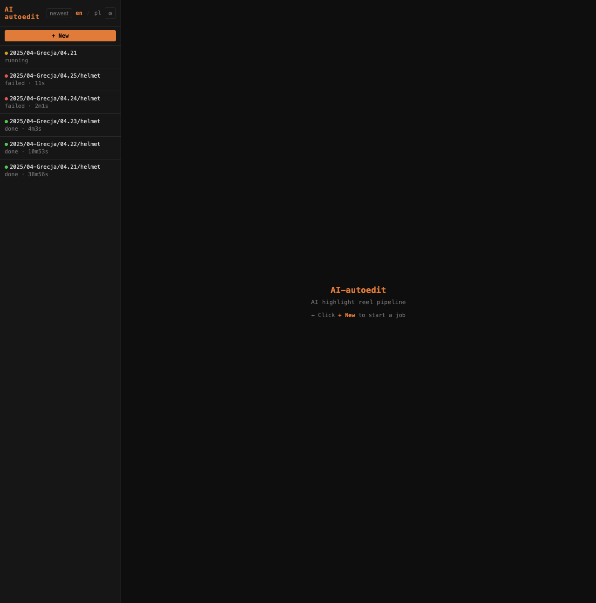
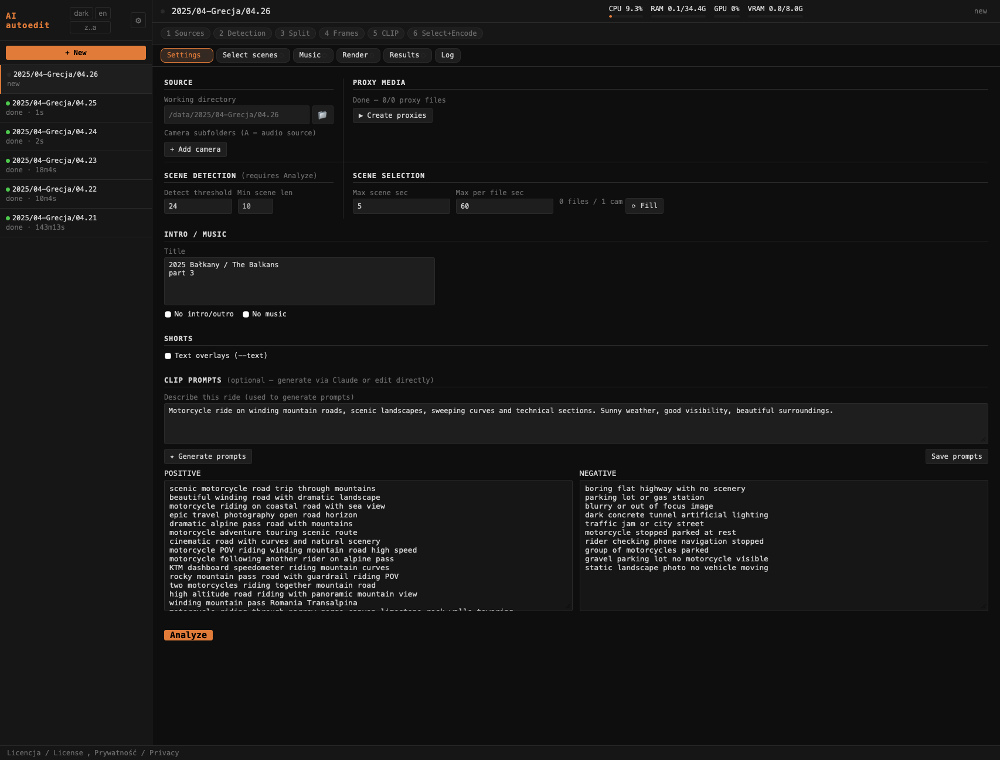
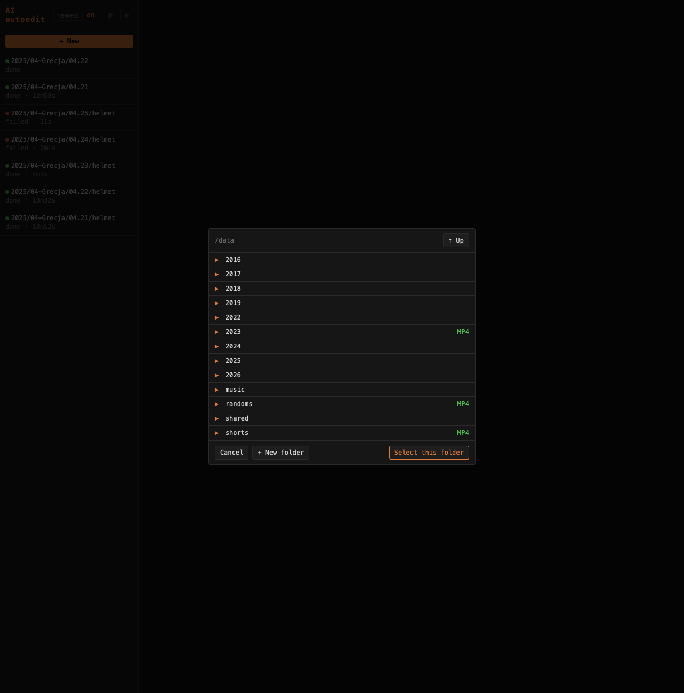

# Lista projektów i nowy projekt / Project list & New project

## Lista projektów / Project list

Lewy pasek wyświetla historię zadań z ich statusem (`done` / `running` / `failed` / `queued`) i czasem trwania. Przełącznik **en / pl** zmienia język interfejsu bez przeładowania strony. Kliknięcie projektu otwiera go i przełącza na zakładkę Summary.

The left sidebar shows job history with status and elapsed time. The **en / pl** switcher changes the interface language without reload. Clicking a project opens it and switches to the Summary tab.

Przycisk **a..z / z..a** sortuje listę projektów alfabetycznie rosnąco lub malejąco według ścieżki katalogu roboczego. Sortowanie leksykograficzne działa poprawnie dla typowej struktury `YYYY/MM-Miejsce/DD` (np. `04.21 < 04.22 < 04.23`). Ustawienie zapisywane jest po stronie serwera.

The **a..z / z..a** button sorts the project list alphabetically ascending or descending by the working directory path. Lexicographic order works correctly for the typical `YYYY/MM-Place/DD` structure (e.g. `04.21 < 04.22 < 04.23`). The preference is saved server-side.

---

## Nowy projekt / New project

Kliknięcie przycisku **+ New project** otwiera przeglądarkę katalogów. Nawigacja: pojedyncze kliknięcie zaznacza katalog, podwójne kliknięcie wchodzi do środka. Katalogi z plikami MP4 oznaczone są plakietką **MP4**, a te z istniejącym cache — plakietką **cached**.

Clicking **+ New project** opens a directory browser. Single-click selects a folder, double-click navigates into it. Folders containing MP4 files are marked with an **MP4** badge; folders with an existing cache show a **cached** badge.

Po wyborze katalogu i kliknięciu **Select** aplikacja:

After selecting a directory and clicking **Select** the app:

| Sytuacja | Zachowanie |
|----------|------------|
| Katalog ma już aktywne zadanie | Otwiera istniejące zadanie |
| Katalog ma pliki wynikowe (`highlight*.mp4`, `_autoframe/`) | Importuje jako zakończone zadanie |
| Nowy katalog | Tworzy szkic projektu i otwiera zakładkę Settings |

Parametry pipeline (kamery, progi, prompty CLIP) konfiguruje się w zakładce **Settings** po otwarciu projektu.

Pipeline parameters (cameras, thresholds, CLIP prompts) are configured in the **Settings** tab after opening the project.
