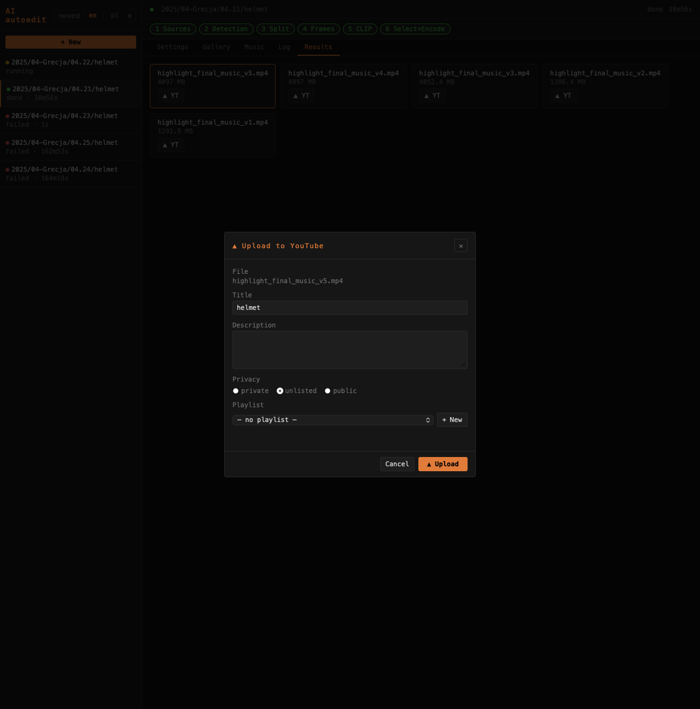

# Zakładka Results / Results tab


Zakładka **Results** wyświetla gotowe pliki wideo projektu z wbudowanym odtwarzaczem.

The **Results** tab lists finished video files for the project with a built-in player.

---

## Odtwarzacz / Player

Kliknięcie pliku otwiera wbudowany odtwarzacz wideo. Obsługuje range requests (Safari, iOS).

Clicking a file opens the built-in video player. Supports range requests (Safari, iOS).

## Pliki wynikowe / Output files

Każdy render tworzy nowy plik zamiast nadpisywać poprzedni:

```
highlight_final_music_v1.mp4   ← pierwszy render
highlight_final_music_v2.mp4   ← nowa muzyka lub zmiana threshold
highlight_final_music_v3.mp4   ← kolejna iteracja
```

Each render creates a new file instead of overwriting:

## Usuwanie / Deleting

Czerwony **×** przy każdym pliku usuwa go z dysku po potwierdzeniu (komunikat w języku interfejsu).

The red **×** next to each file deletes it from disk after confirmation (message in the current interface language).

---

## Upload na YouTube / YouTube upload



Przycisk **▲ YT** przy każdym pliku otwiera modal uploadu.

The **▲ YT** button next to each file opens the upload modal.

| Pole | Opis |
|------|------|
| Title | Tytuł filmu (pre-filled z nazwy projektu) |
| Description | Opis |
| Privacy | private / unlisted / public |
| Playlist | Istniejąca playlista lub nowa (podaj nazwę) |

Progres uploadu widoczny w czasie rzeczywistym w modalu.

Upload progress is shown in real time in the modal.

### Konfiguracja YouTube / YouTube setup

1. Utwórz projekt w [Google Cloud Console](https://console.cloud.google.com) → włącz **YouTube Data API v3**
2. **APIs & Services → Credentials → + Create Credentials → OAuth client ID** → typ **Web application**
3. Dodaj authorized redirect URI: `https://<twój-host>/api/youtube/callback`
4. Pobierz JSON i zapisz jako `webapp/youtube_client_secrets.json`
5. W OAuth consent screen dodaj swoje konto do **Test users**
6. W UI: **⚙ Settings → YouTube → Connect**

Token zapisywany w `webapp/youtube_token.json` i odświeżany automatycznie.

Token is saved in `webapp/youtube_token.json` and refreshed automatically.
