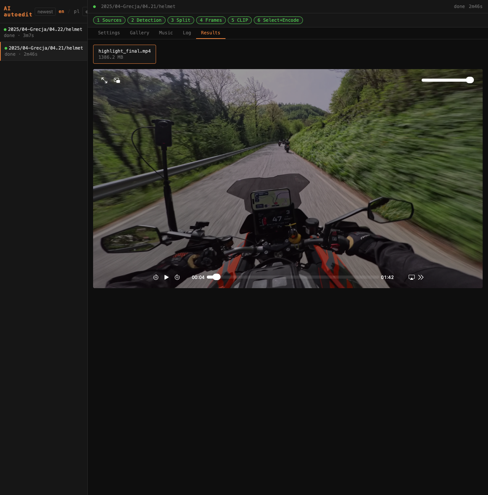
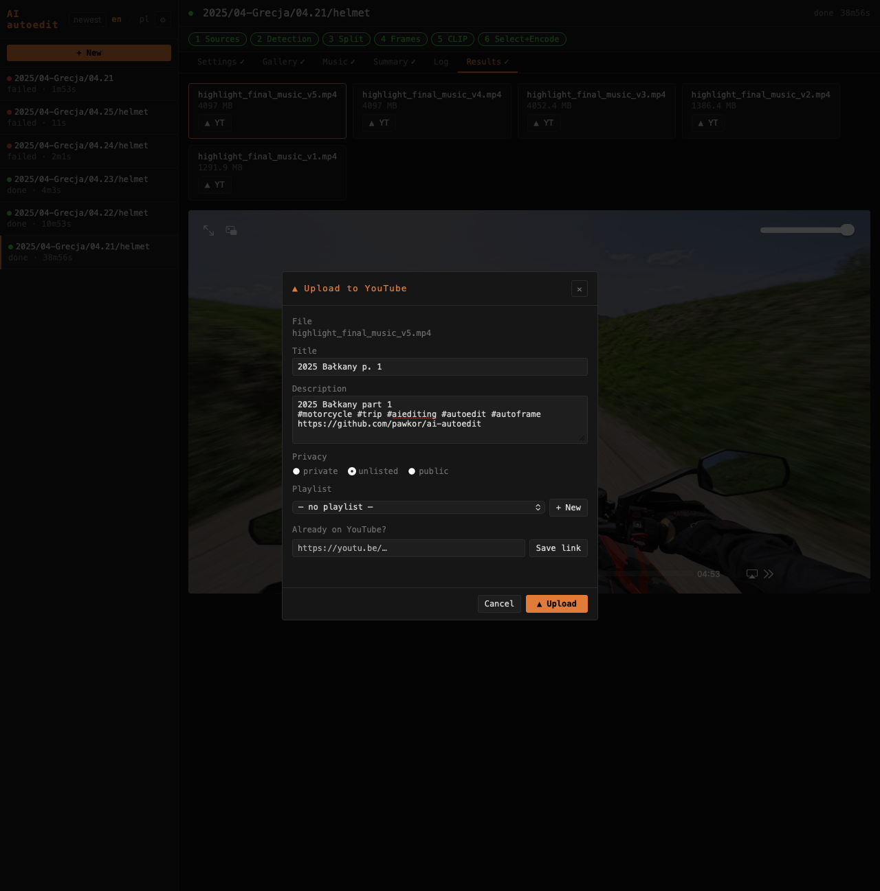
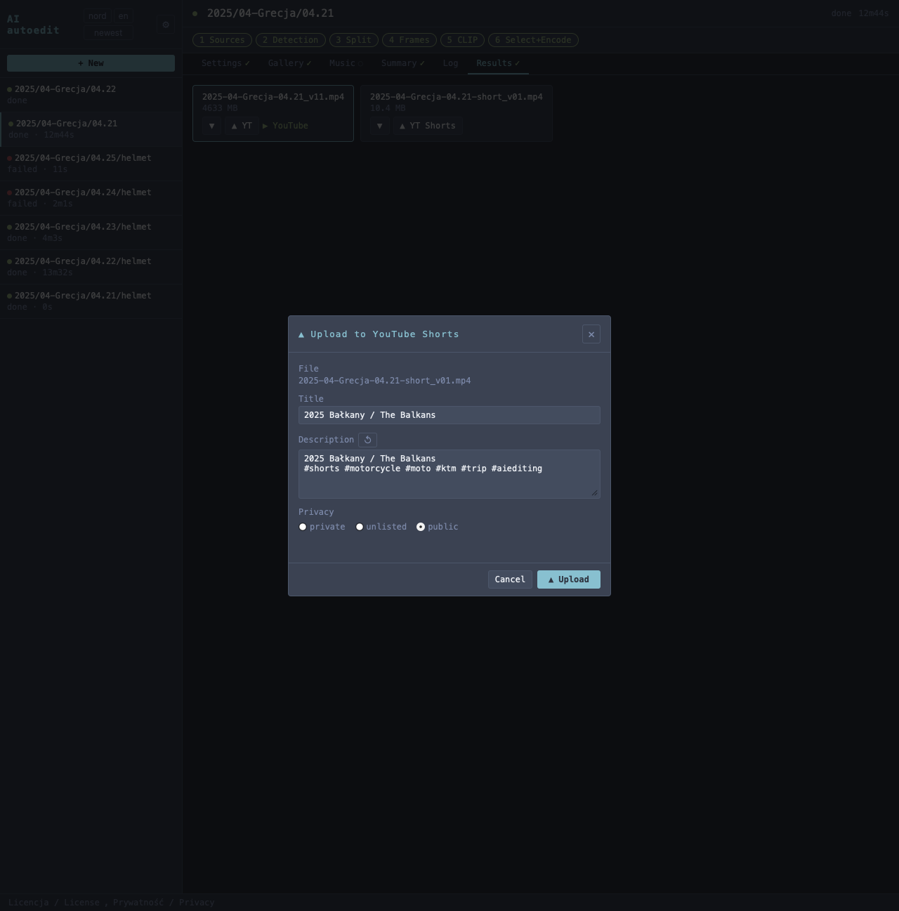
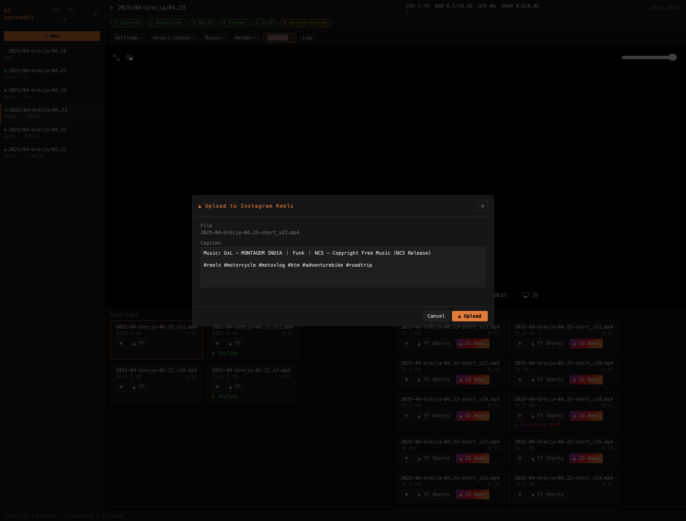
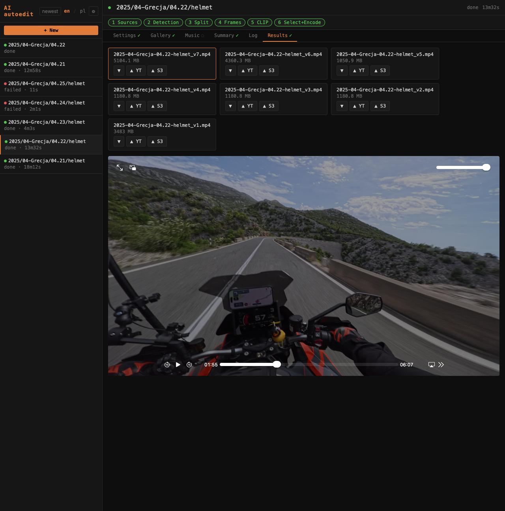
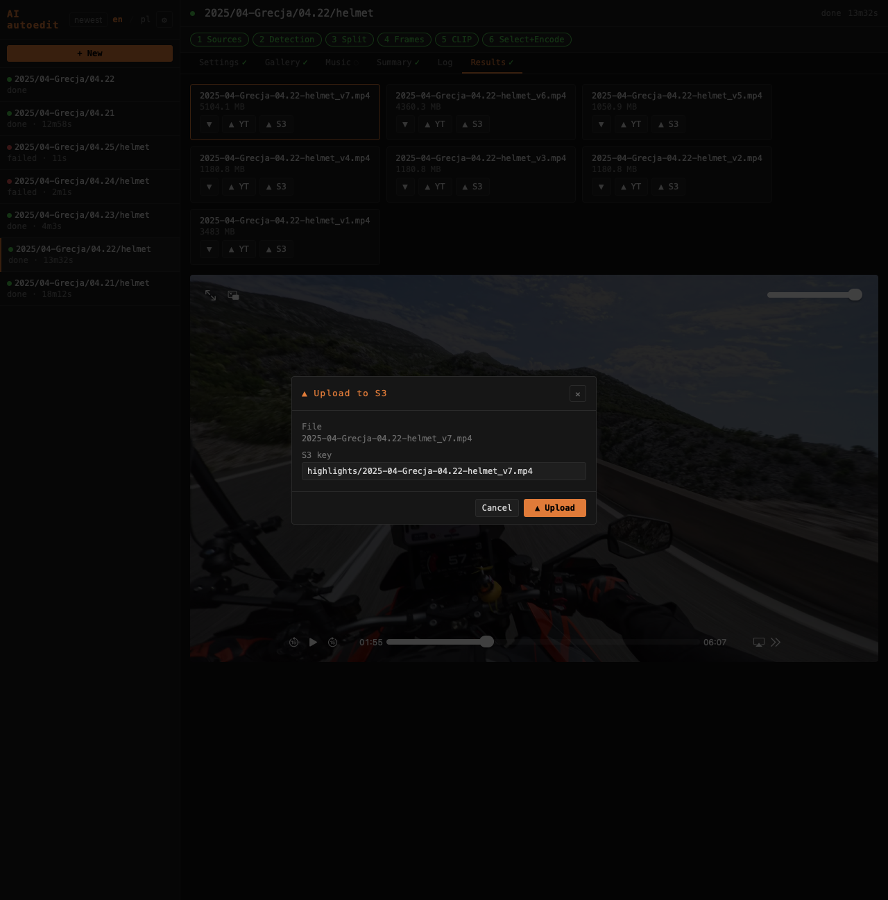

# Zakładka Results / Results tab



Zakładka **Results** wyświetla gotowe pliki wideo projektu z wbudowanym odtwarzaczem.

The **Results** tab lists finished video files for the project with a built-in player.

---

## Układ / Layout

Zakładka Results podzielona jest na dwie kolumny: **Highlight** (lewy) zawiera główne filmy, **Shorts** (prawy) — shorty z `short` w nazwie. Odtwarzacz wideo wyświetlany jest na górze, ponad obiema kolumnami.

The Results tab is split into two columns: **Highlight** (left) lists the main videos, **Shorts** (right) shows shorts (files with `short` in the name). The video player is displayed at the top, above both columns.

---

## Odtwarzacz / Player

Kliknięcie pliku otwiera wbudowany odtwarzacz wideo zajmujący połowę wysokości okna (50vh), zachowując proporcje `object-fit: contain`. Lista plików przewija się poniżej odtwarzacza. Obsługuje range requests (Safari, iOS). Wideo serwowane bezpośrednio przez nginx — nie przechodzi przez Python.

> **Uwaga:** Pliki źródłowe w jakości 4K 60fps przy ~100 Mbps mogą tworzyć w przeglądarce. Przeznaczone są do montażu / przesyłania, a nie do podglądu w przeglądarce. Dla płynnego podglądu użyj VLC przez Sambę.

Clicking a file opens the built-in video player occupying half the window height (50vh) with `object-fit: contain`. The file list scrolls below the player. Supports range requests (Safari, iOS). Video is served directly by nginx — does not go through Python.

> **Note:** Source files at 4K 60fps ~100 Mbps may stutter in the browser. They are intended for editing / uploading, not browser preview. For smooth preview use VLC over Samba.

---

## Pliki wynikowe / Output files

Każdy render tworzy nowy plik zamiast nadpisywać poprzedni. Nazwa pochodzi ze ścieżki projektu względem `BROWSE_ROOT` (`DATA_DIR` w `.env`):

Each render creates a new file instead of overwriting. The name is derived from the project path relative to `BROWSE_ROOT` (`DATA_DIR` in `.env`):

```
2025-04-Grecja-04.21.mp4      ← pierwszy render
2025-04-Grecja-04.21_v2.mp4   ← nowa muzyka lub zmiana threshold
2025-04-Grecja-04.21_v3.mp4   ← kolejna iteracja
```

---

## Usuwanie / Deleting

Czerwony **×** przy każdym pliku usuwa go z dysku po potwierdzeniu (komunikat w języku interfejsu).

The red **×** next to each file deletes it from disk after confirmation (message in the current interface language).

---

## Upload na YouTube / YouTube upload



Przycisk **▲ YT** przy każdym pliku otwiera modal uploadu.

The **▲ YT** button next to each file opens the upload modal.

| Pole | Opis |
|------|------|
| Title | Tytuł filmu (pre-filled z nazwy projektu) |
| Description | Opis |
| Privacy | private / unlisted / public |
| Playlist | Istniejąca playlista lub nowa (podaj nazwę) |

Progres uploadu widoczny w czasie rzeczywistym w modalu.

Upload progress is shown in real time in the modal.

---

## Upload YouTube Shorts / YouTube Shorts upload



Pliki z `short` w nazwie (np. `2025-04-Grecja-04.21-short_v01.mp4`) wyświetlają przycisk **▲ YT Shorts** zamiast **▲ YT**.

Files with `short` in the name (e.g. `2025-04-Grecja-04.21-short_v01.mp4`) show a **▲ YT Shorts** button instead of **▲ YT**.

| Pole | Opis |
|------|------|
| Title | Pre-filled z `[job] title` z config.ini projektu |
| Description | Link do głównego filmu + hashtagi + link GitHub + ↺ Claude |
| Privacy | public / unlisted / private (domyślnie public) |
| Playlist | Istniejąca playlista lub nowa (podaj nazwę) |

Upload jest **zablokowany** jeśli główny film nie ma jeszcze opublikowanego URL na YouTube (wymagany najpierw upload pełnego highlight). Po opublikowaniu głównego filmu opis Shorta automatycznie zawiera `Full video: https://youtu.be/...`.

Upload is **blocked** if the main video has no YouTube URL yet. Once the full highlight is published, the Short description auto-includes `Full video: https://youtu.be/...`.

Domyślny opis nie zawiera tytułu: `Full video: <url>\n\n#shorts #motorcycle …\nhttps://github.com/pawkor/ai-autoedit`

Gdy projekt ma więcej niż jeden główny film na YouTube, pojawia się dropdown do wyboru, z którym filmem powiązać Shorta.

Default description (no title): `Full video: <url>\n\n#shorts #motorcycle …\nhttps://github.com/pawkor/ai-autoedit`

When the project has more than one main YouTube video, a dropdown lets you pick which full video to link.

> **Uwaga:** Upload Shorts do YouTube używa tego samego tokenu OAuth co zwykłe filmy.
>
> **Note:** Shorts upload uses the same OAuth token as regular video upload.

### Konfiguracja YouTube / YouTube setup

1. Utwórz projekt w [Google Cloud Console](https://console.cloud.google.com) → włącz **YouTube Data API v3**
2. **APIs & Services → Credentials → + Create Credentials → OAuth client ID** → typ **Web application**
3. Dodaj authorized redirect URI: `https://<twój-host>/api/youtube/callback`
4. Pobierz JSON i zapisz jako `webapp/youtube_client_secrets.json`
5. W OAuth consent screen dodaj swoje konto do **Test users**
6. W UI: **⚙ Settings → YouTube → Connect**

Token zapisywany w `webapp/youtube_token.json` i odświeżany automatycznie.

Token is saved in `webapp/youtube_token.json` and refreshed automatically.

---

## Upload Instagram Reels / Instagram Reels upload



Przycisk **▲ IG Reel** widoczny jest przy shortach oznaczonych jako NCS (plik muzyczny z biblioteki NCS). Otwiera modal uploadu rolki na Instagram.

The **▲ IG Reel** button appears on shorts marked as NCS (music file from the NCS library). Opens the Instagram Reel upload modal.

| Pole | Opis |
|------|------|
| Caption | Opis rolki — pre-filled z atrybutorem NCS (`Music: Artist - Title (NCS Release)`) + hashtagi |
| Cover time (s) | Sekunda wideo użyta jako miniaturka |
| Share to feed | Publikuje równocześnie w feedzie i w Reels |

Przed uploadem sprawdzany jest status tokenu Instagram. Jeśli token wygasa w ciągu 7 dni, wyświetlane jest ostrzeżenie z liczbą dni do wygaśnięcia.

Before upload the Instagram token status is checked. If the token expires within 7 days, a warning with the number of days is shown.

### Wymagania / Requirements

- Konto Instagram **Creator** lub **Business** (nie Personal)
- Połączone z Facebook Page
- Token długotrwały wygenerowany przez Graph API Explorer z uprawnieniami: `instagram_basic`, `instagram_content_publish`, `pages_show_list`, `pages_read_engagement`
- Zmienne środowiskowe w `.env`: `IG_ACCESS_TOKEN`, `IG_USER_ID`, `IG_APP_ID`, `IG_APP_SECRET`

Token odświeżany automatycznie co 24h przez serwer (długotrwałe tokeny wygasają po 60 dniach, serwer odświeża co 30 dni).

Token is refreshed automatically every 24 hours by the server (long-lived tokens expire after 60 days; server refreshes every 30 days).

### Atrybucja NCS / NCS attribution

NCS (NoCopyrightSounds) wymaga podania w opisie: `Music: Artist - Title (NCS Release)`. Tekst jest automatycznie pre-fillowany z metadanych pliku muzycznego. Warunek konieczny do legalnego używania muzyki NCS w Reels.

NCS (NoCopyrightSounds) requires the caption to include: `Music: Artist - Title (NCS Release)`. The text is auto-filled from the music file metadata. This is required for legal use of NCS music in Reels.

---

## Experimental / Untested

### Upload do S3 / Upload to S3



Gdy S3 jest skonfigurowane, przy każdym pliku wynikowym pojawia się przycisk **▲ S3**.

When S3 is configured, an **▲ S3** button appears next to each result file.



Kliknięcie otwiera modal uploadu. Pole **S3 key** jest pre-filled jako `highlights/<nazwa_pliku>` — można zmienić przed wysłaniem.

Clicking opens the upload modal. The **S3 key** field is pre-filled as `highlights/<filename>` — editable before uploading.

Pasek postępu i prędkość transferu widoczne w czasie rzeczywistym.

Upload progress bar and transfer speed are shown in real time.
