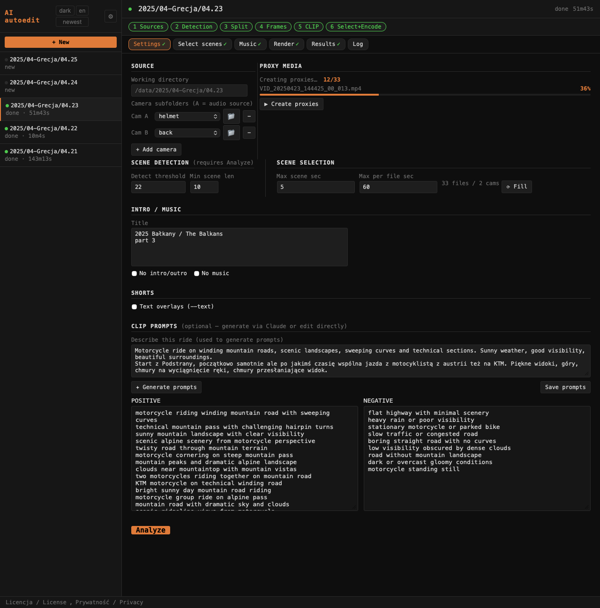
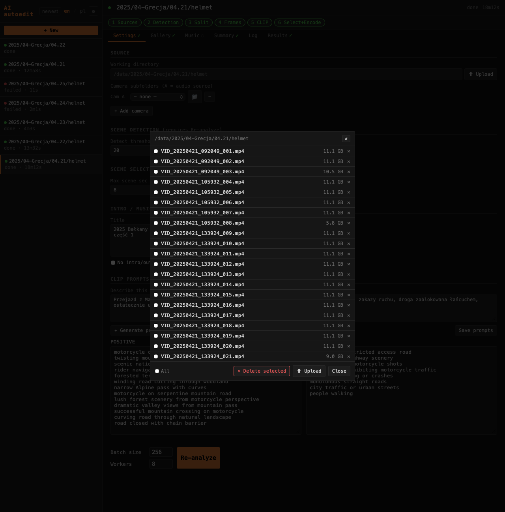

# Zakładka Settings / Settings tab

Zakładka **Settings** pozwala zmieniać wszystkie parametry pipeline bez edytowania plików. Każde pole zapisuje się do `config.ini` projektu automatycznie po opuszczeniu pola (Enter lub kliknięcie gdzie indziej).

The **Settings** tab lets you change all pipeline parameters without editing files. Every field saves to the project's `config.ini` automatically on blur or Enter.

---

## Sekcje / Sections

### Source / Proxy media

Katalog roboczy z plikami MP4 (tylko do odczytu — ustawiony przy tworzeniu projektu). Przycisk 📁 otwiera przeglądarkę plików dla tego katalogu (patrz niżej).

Working directory with MP4 files (read-only — set when the project is created). The 📁 button opens the file browser for that directory (see below).

**Konfiguracja kamer / Camera configuration**



Lista podkatalogów kamer. Cam A = źródło audio; pozostałe kamery są wyciszane w mikście. Przycisk **+ Add camera** dodaje kolejny wiersz. Przycisk 📁 przy każdej kamerze otwiera przeglądarkę plików dla tego podkatalogu.

List of camera subdirectories. Cam A = audio source; other cameras are muted in the mix. **+ Add camera** adds a row. The 📁 button next to each camera opens the file browser for that subfolder.

**Przesunięcia zegarowe kamer / Camera clock offsets**

Pole **Clock offset (s)** przy każdej kamerze pozwala skompensować stały dryft zegara — np. kask nagrany 2h za wcześnie (Helmet Ace Pro 2) → wpisz `7200`. Wartości zapisywane są w sekcji `[cam_offsets]` w `config.ini` projektu i stosowane przy synchronizacji multicam.

The **Clock offset (s)** field per camera compensates for a fixed clock drift — e.g. a helmet cam recorded 2h early → enter `7200`. Values are saved in `[cam_offsets]` in the project `config.ini` and applied during multicam sync.

**Proxy media**

Sekcja **Proxy media** (po prawej stronie Source) tworzy zmniejszone kopie plików źródłowych (480p, 20 fps CFR) używane jako wejście do wykrywania scen. Proxy drastycznie skraca czas detekcji przy zachowaniu identycznych cięć.

The **Proxy media** section (to the right of Source) creates downscaled copies of source files (480p, 20 fps CFR) used as input for scene detection. Proxies dramatically reduce detection time while producing identical cut points.

| Element | Opis / Description |
|---------|-------------------|
| Status | Liczba gotowych proxy / całkowita liczba plików źródłowych (np. `12/33`) |
| Pasek postępu | Widoczny podczas tworzenia; znika po zakończeniu |
| **▶ Create proxies** | Uruchamia tworzenie proxy sekwencyjnie dla brakujących plików. Proxy tworzone są atomowo (`.mp4.tmp` → `.mp4`), więc przerwanie jest bezpieczne — wznowienie pomija gotowe pliki |

Proxy są przechowywane w `_autoframe/proxy/` i nie wliczają się do plików wynikowych. Otworzenie projektu automatycznie uruchamia tworzenie proxy jeśli brakuje jakichkolwiek plików.

Proxies are stored in `_autoframe/proxy/` and are not included in output files. Opening a project automatically starts proxy creation if any files are missing.

---

### Scene detection *(requires Re-analyze)*

Parametry PySceneDetect — wpływają na etap detekcji cięć. Zmiana wymaga Re-analyze żeby przeliczyć sceny od nowa.

PySceneDetect parameters — affect the cut detection stage. Changes require Re-analyze to reprocess scenes.

| Parametr | Domyślnie | Opis / Description |
|----------|-----------|---------------------|
| Detect threshold | `20` | Czułość detektora. Wyższy = mniej cięć. Dla leśnego materiału zalecane 24–28. / Detector sensitivity. Higher = fewer cuts. For forest/lighting-heavy footage try 24–28. |
| Min scene len | `8` | Minimalna długość sceny w sekundach. / Minimum scene duration in seconds. |

---

### Scene selection

| Parametr | Opis / Description |
|----------|--------------------|
| Max scene sec | Maks. czas wycinany z jednej sceny (środek klipu). / Max seconds taken per scene (centred). |
| Max per file sec | Maks. łączny czas z jednego pliku. Nadmiarowe sceny oznaczone jako „limit" w Gallery. / Max total seconds from one source file. Excess scenes shown as "limit" in Gallery. |
| Target min | Docelowy czas highlight w minutach — używany przez automatyczne wyszukiwanie progu w Gallery i przycisk ⟳ Fill. / Target highlight duration in minutes — used by the Gallery auto threshold search and the ⟳ Fill button. |

Przycisk **⟳ Fill** oblicza Max scene sec i Max per file sec automatycznie na podstawie liczby plików źródłowych i docelowego czasu.

The **⟳ Fill** button auto-calculates Max scene sec and Max per file sec from the source file count and target duration.

Threshold CLIP ustawiany jest na żywo przez suwak w zakładce Gallery.

The CLIP threshold is set live via the Gallery slider — not in Settings.

---

### Intro / music

| Parametr | Opis / Description |
|----------|--------------------|
| Title | Tytuł na kartce intro. Każda linia = jeden wiersz tekstu. Pozostaw puste dla auto (rok + folder). / Intro card title. Each line = one text row. Leave empty for auto (year + folder). |
| Music directory | Katalog z biblioteką MP3 do miksowania. / Directory with the MP3 library for mixing. |
| No intro/outro | Pomija generowanie karty intro i czarnego outro. / Skips intro card and black outro generation. |
| No music | Pomija miks muzyczny. / Skips the music mix. |

---

### CLIP prompts

Opis wyjazdu (pole **About this ride**) + przycisk **✦ Generate CLIP prompts** wywołuje Claude API i generuje prompty POSITIVE/NEGATIVE dopasowane do opisu. Wyniki pojawiają się w polach poniżej. **Save prompts** zapisuje je do `config.ini` projektu.

The **About this ride** field + **✦ Generate CLIP prompts** button calls the Claude API and generates POSITIVE/NEGATIVE prompts matched to the ride description. Results appear in the fields below. **Save prompts** writes them to the project's `config.ini`.

Prompty POSITIVE/NEGATIVE można też edytować bezpośrednio, jeden prompt na linię.

POSITIVE/NEGATIVE prompts can also be edited directly, one prompt per line.

---

### CLIP scoring

| Parametr | Domyślnie | Opis / Description |
|----------|-----------|--------------------|
| Batch size | `64` | Klatki przez GPU jednocześnie. Obniż do 32/16 przy błędach OOM. / Frames per GPU batch. Lower to 32/16 if OOM errors occur. |
| Workers | `4` | Wątki ładowania klatek. / Frame-loading worker threads. |

---

### Shorts

Parametry generowania krótkich filmów (YouTube Shorts / Instagram Reels).

Parameters for short-form video generation (YouTube Shorts / Instagram Reels).

| Parametr | Opis / Description |
|----------|--------------------|
| **Text overlays** | Dodaje animowane hashtagi do shorta (flaga `--text` w `make_shorts.py`). / Adds animated hashtags to the short (`--text` flag in `make_shorts.py`). |
| **Crop X offsets** | Przesunięcie poziome kadru 9:16 per kamera (piksele). Format: `kamera=wartość`, jedna para na linię. Np. `back=-250` przesuwa kadr tylnej kamery o 250 px w lewo. Używane gdy obiekt jest poza środkiem kadru po automatycznym przycinaniu do 9:16. / Horizontal crop offset for 9:16 per camera (pixels). Format: `camera=value`, one pair per line. E.g. `back=-250` shifts the back camera crop 250 px left. Used when the subject is off-center after the automatic 9:16 crop. |

---

## Re-analyze with these settings

Uruchamia pipeline od nowa. Pomija detekcję scen jeśli pliki źródłowe i parametry `[scene_detection]` nie zmieniły się.

Reruns the pipeline. Skips scene detection if source files and `[scene_detection]` parameters haven't changed.

---

## Przeglądarka plików / File browser



Otwierana przyciskiem 📁 przy katalogu roboczym lub podkatalogu kamery. Wyświetla pliki wideo (MP4, MOV, MTS, M2TS i inne) w danym katalogu.

Opened via the 📁 button next to the working directory or a camera subfolder. Shows video files (MP4, MOV, MTS, M2TS, etc.) in that directory.

| Akcja | Opis |
|-------|------|
| Najechanie kursorem na plik | Podgląd wideo (miniaturka 240×135) |
| **×** przy pliku | Usuwa plik z dysku po potwierdzeniu |
| Checkbox przy pliku | Zaznacza do grupowego usunięcia |
| **Delete checked** | Usuwa zaznaczone pliki po potwierdzeniu |
| **+ Folder** | Tworzy nowy podkatalog |
| **↑ Upload** | Przesyła pliki z przeglądarki do tego katalogu |

---

## Experimental / Untested

### S3 source

Sekcja **S3 source** pojawia się automatycznie gdy w `.env` skonfigurowane są zmienne `S3_BUCKET`, `S3_ACCESS_KEY_ID` i `S3_SECRET_ACCESS_KEY`. Umożliwia pobieranie plików źródłowych wideo bezpośrednio z bucketa S3 przed uruchomieniem pipeline.

The **S3 source** section appears automatically when `S3_BUCKET`, `S3_ACCESS_KEY_ID`, and `S3_SECRET_ACCESS_KEY` are set in `.env`. It allows fetching source video files from an S3 bucket before running the pipeline.

Lista plików: ikona ☁ = tylko na S3, ✓ = już pobrane lokalnie. Checkbox przy pliku zaznacza go do pobrania.

File list: ☁ = S3 only, ✓ = already downloaded locally. Checkbox marks a file for download.

| Przycisk | Opis |
|----------|------|
| **↺** (nagłówek) | Odświeża listę plików z S3 |
| All missing | Zaznacza wszystkie pliki których brakuje lokalnie |
| **↓ Fetch selected** | Pobiera zaznaczone pliki z S3 do katalogu roboczego, pasek postępu per-plik |
| **✕ Purge local** | Usuwa lokalne pliki źródłowe i przetworzone klipy (`_autoframe/autocut/`) żeby zwolnić miejsce |

Konfiguracja S3 w `.env` / S3 configuration in `.env`:

```
S3_BUCKET=my-bucket
S3_ACCESS_KEY_ID=your-key-id
S3_SECRET_ACCESS_KEY=your-secret
S3_REGION=us-east-1
S3_ENDPOINT_URL=https://...   # opcjonalne: Backblaze B2, Cloudflare R2, MinIO / optional
```
