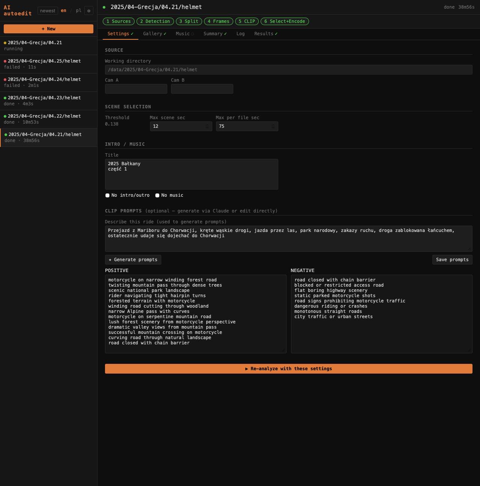

# Zakładka Settings / Settings tab

Zakładka **Settings** pozwala zmieniać wszystkie parametry pipeline bez edytowania plików. Zmiany zapisywane są do `config.ini` projektu po kliknięciu **Re-analyze with these settings**.

The **Settings** tab lets you change all pipeline parameters without editing files. Changes are saved to the project's `config.ini` on **Re-analyze with these settings**.

---

## Sekcje / Sections

### Sources / Working directory

Katalog roboczy z plikami MP4 oraz katalog muzyczny. Zmiana katalogu i kliknięcie Rerun traktuje nowy katalog jako nowy projekt.

Working directory with MP4 files and music directory. Changing the directory and rerunning treats it as a new project.

### Scene selection

| Parametr | Opis |
|----------|------|
| Max scene sec | Maksymalny czas wycinany z jednej sceny (wyśrodkowany na środku klipu). |
| Max per file sec | Maksymalny łączny czas z jednego pliku źródłowego. Sceny przekraczające ten limit oznaczone są w Gallery jako „limit". |

Threshold CLIP ustawiany jest na żywo przez suwak w zakładce Gallery — nie ma go w Settings.

The CLIP threshold is set live via the Gallery slider — it is not in Settings.

### CLIP / Music

Pola opisu wyjazdu, generowania promptów przez Claude API oraz konfiguracja muzyki (No music). Szczegóły generowania promptów: [Nowy projekt](ui-projects.md).

Ride description, Claude-based prompt generation, and music config (No music checkbox). Prompt generation details: [New project](ui-projects.md).

### POSITIVE / NEGATIVE prompts

Edytowalne bezpośrednio. Każdy prompt w osobnej linii. **Save prompts** zapisuje je niezależnie od Rerun.

Editable directly. One prompt per line. **Save prompts** saves them independently of Rerun.

---

## Re-analyze with these settings

Zapisuje zmiany do `config.ini` projektu i uruchamia pipeline od etapu CLIP (pomija detekcję scen jeśli nie zmieniły się pliki).

Saves changes to the project's `config.ini` and reruns the pipeline from the CLIP stage (skips scene detection if source files haven't changed).
