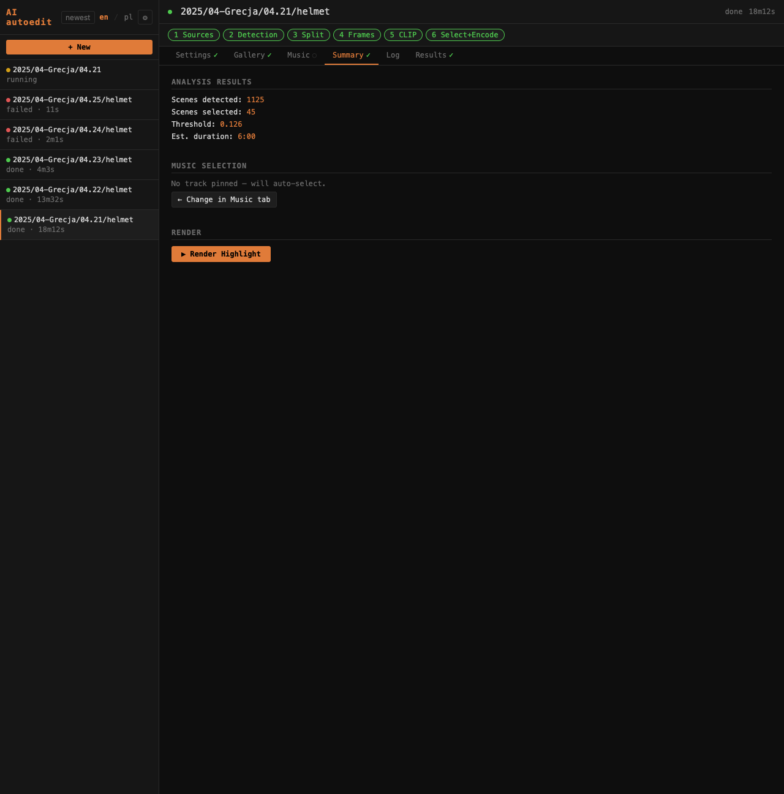

# Zakładka Summary / Summary tab

Zakładka **Summary** zbiera wyniki analizy i daje dostęp do renderowania.

The **Summary** tab aggregates analysis results and provides access to rendering.

---

## Analysis results

| Pole | Opis |
|------|------|
| Scenes detected | Łączna liczba wykrytych scen |
| Scenes selected | Liczba scen wybranych do highlight (po threshold, overrides i balansowaniu kamer) |
| Scoring | Aktualny próg CLIP (zsynchronizowany z Gallery) |
| Est. duration | Szacowany czas highlight na podstawie wybranych scen |

Wartości aktualizują się na żywo po każdej zmianie threshold lub kliknięciu klatki w Gallery.

Values update live after every threshold change or Gallery frame click.

| Field | Description |
|-------|-------------|
| Scenes detected | Total number of detected scenes |
| Scenes selected | Scenes selected for the highlight (after threshold, overrides, and camera balancing) |
| Scoring | Current CLIP threshold (synced with Gallery) |
| Est. duration | Estimated highlight duration based on selected scenes |

---

## Music selection

Pokazuje wybraną ścieżkę muzyczną lub informację o braku zaznaczonej muzyki. Link **→ Change in Music tab** przenosi bezpośrednio do zakładki Music.

Shows the selected music track or a notice if no music is selected. **→ Change in Music tab** link navigates directly to the Music tab.

---

## ▶ Render Highlight

Uruchamia finalne enkodowanie z bieżącym threshold i overrides. Pod przyciskiem pojawia się pasek postępu z ETA aktualizowany w czasie rzeczywistym.

Starts final encoding with the current threshold and overrides. A real-time progress bar with ETA appears below the button.

Pipeline renderuje: selekcja scen → przycinanie → concat → intro/outro → miks muzyczny → plik wynikowy (np. `2025-04-Grecja-04.21.mp4`).

The pipeline renders: scene selection → trimming → concat → intro/outro → music mix → output file (e.g. `2025-04-Grecja-04.21.mp4`).

Kolejne rendery z nową muzyką lub innym threshold tworzą nowy plik (v2, v3…) — poprzednie wersje nie są nadpisywane.

Subsequent renders with new music or a different threshold create a new file (v2, v3…) — previous versions are not overwritten.
